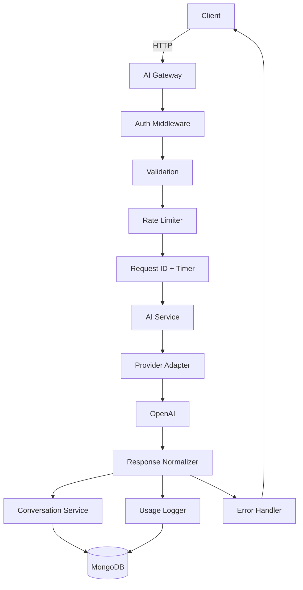

# AI Gateway

## 1. Problem

Many client applications should not call LLM providers directly. They need a backend gateway that handles authentication, validation, rate limiting, provider abstraction, cost visibility, and conversation persistence.

This project is a minimal but production-minded prototype that acts as an API gateway between clients and OpenAI-compatible models.

## 2. Solution

The application exposes a secure backend API that authenticates users via JWT, validates requests, limits traffic, calls an AI provider through a clean abstraction layer, stores chat history, logs usage, and returns consistent error responses.

## 3. Features

- JWT authentication and authorization
- Register/login endpoints
- AI chat using OpenAI or demo mode fallback
- Structured output analysis endpoint
- Conversation ownership enforcement
- Usage metrics API
- Rate limiting and timeout handling
- Retry for transient provider failures
- Request IDs and standardized error responses
- Swagger/OpenAPI docs
- MongoDB storage model
- Test coverage for core business rules

## 4. Architecture



## 5. Technology Stack

- Node.js
- TypeScript
- Express.js
- MongoDB + Mongoose
- OpenAI SDK
- JWT + bcrypt
- Zod validation
- Pino logging
- Express rate limit
- Helmet + CORS
- Swagger UI
- Vitest + Supertest

## 6. Project Structure

```text
src/
  config/
  controllers/
  middleware/
  models/
  providers/
  routes/
  schemas/
  services/
  utils/
  app.ts
  server.ts

tests/
  usageService.test.ts

docs/
  database-schema.md
  ai-gateway.postman_collection.json
```

## 7. Database Schema

### users
- `_id`: ObjectId
- `email`: string (unique)
- `passwordHash`: string
- `name`: string
- `createdAt` / `updatedAt`

### conversations
- `_id`: ObjectId
- `userId`: ObjectId
- `title`: string
- `model`: string
- `messages`: array of chat messages
- `createdAt` / `updatedAt`

### usage_logs
- `_id`: ObjectId
- `userId`: ObjectId
- `model`: string
- `timestamp`: Date
- `latencyMs`: number
- `inputTokens`: number
- `outputTokens`: number
- `totalTokens`: number
- `status`: success | error
- `errorCode`: string
- `errorMessage`: string
- `requestId`: string

## 8. API Documentation

Swagger is served from `/api-docs` when the app is running.

Endpoints include:
- `POST /api/auth/register`
- `POST /api/auth/login`
- `GET /api/auth/me`
- `POST /api/ai/chat`
- `POST /api/ai/analyze`
- `GET /api/conversations`
- `GET /api/conversations/:id`
- `DELETE /api/conversations/:id`
- `GET /api/usage`
- `GET /api/health`

## 9. Authentication

JWT tokens are used for protected endpoints.

Header format:

```http
Authorization: Bearer <token>
```

## 10. AI Integration

The gateway uses an abstraction layer:

- `AIProvider` interface
- `OpenAIProvider` implementation
- `AIService` orchestrates provider calls

This keeps provider-specific logic away from the controller layer.

## 11. Retry Strategy

Retry occurs only for transient failures such as:
- HTTP 429
- HTTP 500
- HTTP 502
- HTTP 503
- network timeout

Not retried:
- auth failures
- validation issues
- invalid API key
- malformed request

Backoff is exponential: 500ms → 1000ms → 2000ms.

## 12. Timeout Strategy

Every provider request is bounded by `AI_TIMEOUT_MS` (default `10000`). If the provider exceeds the timeout, the API returns `504` with code `AI_PROVIDER_TIMEOUT`.

## 13. Rate Limiting

The prototype uses in-memory rate limiting in Express.

Policy:
- 60 requests/minute/user if authenticated
- otherwise keyed by IP

This is suitable for a prototype and demo environment. Production should use Redis-backed rate limiting.

## 14. Error Handling

All APIs return a unified envelope:

```json
{
  "success": false,
  "error": {
    "code": "ERROR_CODE",
    "message": "Human readable message",
    "requestId": "abc123"
  }
}
```

## 15. Usage Metrics

`GET /api/usage` calculates metrics using actual database records.

Formulas:
- `requests` = total AI requests
- `tokens` = total input + output tokens
- `average_latency_ms` = total latency / request count
- `error_rate` = error request count / total requests

## 16. Security

- password hashing using bcrypt
- JWT for auth
- request validation via Zod
- Helmet and CORS enabled
- no secrets committed into source control
- API keys remain in env variables only
- sensitive data not logged

## 17. Local Setup

1. Copy `.env.example` to `.env`
2. Set your values
3. Install dependencies
4. Run the server

```bash
npm install
cp .env.example .env
npm run dev
```

## 18. Environment Variables

```env
PORT=5000
MONGODB_URI=mongodb://localhost:27017/ai_gateway
JWT_SECRET=change_me_in_production
OPENAI_API_KEY=
OPENAI_MODEL=gpt-4o-mini
AI_TIMEOUT_MS=10000
RATE_LIMIT_WINDOW_MS=60000
RATE_LIMIT_MAX_REQUESTS=60
LOG_LEVEL=info
```

## 19. Running the Project

```bash
npm install
npm run build
npm run test
npm run dev
```

## 20. Testing

Core validation is covered in `tests/usageService.test.ts`.

Current checks include:
- usage math calculations
- chat payload validation
- structured analysis payload validation

## 21. Postman

A sample Postman collection is available in `docs/ai-gateway.postman_collection.json`.

## 22. Deployment

This is designed as a prototype suitable for local demo or deployment to a managed Node.js host. It can be deployed to Render, Railway, Fly.io, or any similar environment with MongoDB configured.

## 23. Limitations

- in-memory rate limiting is not cluster-safe
- provider fallback is intentionally simple
- usage is a prototype estimate, not a billing engine
- OpenAI demo fallback is activated when API key is missing

## 24. Future Improvements

- Redis rate limiting
- provider fallback model routing
- cost estimation service
- better observability dashboard
- more structured provider adapters for Gemini/Claude
- background worker queue for heavy requests

---

This project is intended as a demo-ready AI gateway prototype that remains understandable and easy to extend.
